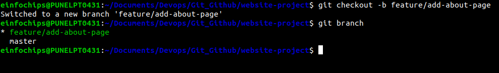
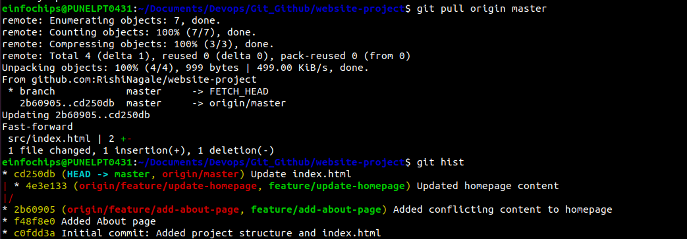

Git Project
======
**Objective:**
You will work on a project involving a simple website. You will learn and practise various Git concepts including branching, merging, handling merge conflicts, rebasing, pulling, versioning, and rolling back changes. This project is designed to be completed in 1 hour.

#### Project Setup

1. **Install Git & Set Up Git:** 

- Ensure Git is installed on your system. Verify with 
```vim
git --version.
```
- Configure your Git username and email:
```vim
git config --global user.name "Your Name"
git config --global user.email "your.email@example.com"
```

2. **Create a GitHub Repository:**
- Go to GitHub and create a new repository named website-project.

Clone the repository to your local machine:
```
git clone https://github.com/your-username/website-project.git
```

3. **Initialize the Project**:

- Navigate to the project directory:

```bash
cd website-project
```


Create initial project structure: 
```bash
mkdir src
touch src/index.html

echo "<!DOCTYPE html><html><head><title>My Website</title></head><body><h1>Welcome to my website!</h1></body></html>" > src/index.html
```
Commit and push the initial project structure: 
```
git add .
git commit -m "Initial commit: Added project structure and index.html"
git push origin master
```


## Exercise 1: Branching and Basic Operations

**Create a New Branch**:

> git checkout -b feature/add-about-page



1. **Add a New Page**:

- Create about.html:

```bash
touch src/about.html
echo "<!DOCTYPE html><html><head><title>About Us</title></head><body><h1>About Us</h1></body></html>" > src/about.html
```

- Commit and push changes:
```
git add src/about.html
git commit -m "Added about page"
git push origin feature/add-about-page
```


## Exercise 2: Merging and Handling Merge Conflicts

- Create Another Branch:
```
git checkout master
git checkout -b feature/update-homepage
```


1. **Update the Homepage**:

Modify index.html:
```bash
echo "<p>Updated homepage content</p>" >> src/index.html

Commit and push changes:
git add src/index.html
git commit -m "Updated homepage content"
git push origin feature/update-homepage
```


2. **Create a Merge Conflict**:

Modify index.html on the feature/add-about-page branch: 
```bash
git checkout feature/add-about-page
echo "<p>Conflict content</p>" >> src/index.html
git add src/index.html
git commit -m "Added conflicting content to homepage"
git push origin feature/add-about-page
```


3. **Merge and Resolve Conflict**:

Attempt to merge feature/add-about-page into master:
```bash
git checkout master
git merge feature/add-about-page
git push origin master
```


## Exercise 3: Rebasing

1. **Rebase a Branch**:

Rebase feature/update-homepage onto master:
```bash
git checkout feature/update-homepage 
git rebase master
```


- Resolve any conflicts that arise during rebase.

**Push the Rebased Branch**:
```bash
git push -f origin feature/update-homepage
```


## Exercise 4: Pulling and Collaboration

1. **Pull Changes from Remote**:

Ensure the master branch is up-to-date:
```bash
git checkout master
git pull origin master
```


2. **Simulate a Collaborator's Change**:
- Make a change on GitHub directly (e.g., edit index.html).
3. **Pull Collaborator's Changes**:

Pull the changes made by the collaborator: 
```
git pull origin master
```

## Exercise 5: Versioning and Rollback

1. **Tagging a Version**:

Tag the current commit as v1.0:
```
git tag -a v1.0 -m "Version 1.0: Initial release" 
git push origin v1.0
```

2. **Make a Change that Needs Reversion**:

Modify index.html:
```
echo "<p>Incorrect update</p>" >> src/index.html
git add src/index.html
git commit -m "Incorrect update" 
git push origin master
```


3. **Revert to a Previous Version**:

Use git revert to undo the last commit:
```
git revert HEAD
git push origin master
git reset --hard v1.0
git push -f origin master
```


**Extra Activities**

1. **Stashing Changes**:

Make some local changes without committing:

> echo "<p>Uncommitted changes</p>" >> src/index.html 

Stash the changes:

> git stash


Apply the stashed changes: 
```
git stash apply
```


2. **Viewing Commit History**:

Use git log to view commit history: 
```
git log --oneline
```


3. **Cherry-Picking Commits**:

Create a new branch and cherry-pick a commit from another branch and solving the conflict if any:
```
git checkout -b feature/cherry-pick
```
```
git cherry-pick <commit-hash>
git cherry-pick --continue
```

```
git push origin feature/cherry-pick
```


4. **Interactive Rebase**:

Use interactive rebase to squash commits:
```
git checkout master
git rebase -i HEAD~3
```

